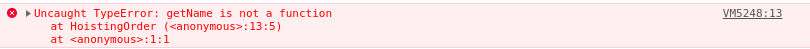

# Javascript-1

- Developed in 1995 by Brendan Eich
- how ***v8*** engine was named
- checkout electronjs
- ECMAScript6
- checkout how to write conditional statements, loops

- **scoping and**

- **Hoisting**: 

  - **Orders**:
    1. all variable declarations (including function) with `undefined` 
       - In this case all variable declaration comes first then function declaration 
    2. all executions like assigning values.

  

  Some examples:

  1. ```js
     var str = 'I am at global scope';
     function f1() {
         console.log(str);
         var str = 'I am at local scope of function f1';
     }
     f1();
     ```

     what should be the output? 

     Surprisingly, output will be `undefined`

     *Load Order*:

     ```ps
     var str = undefined
     function f1() {
         var str = undefined
         console.log(str);
         str = 'I am at local scope of function of f1';
     }
     ```

     

     if similar example is written in this way:

     ```js
     var str = 'I am at global scope';
     function f1() {
             var str = 'I am at local scope of function f1';
         console.log(str);
     }
     f1();
     ```

     then, output should be `I am at local scope of function f1`.  Because this time *load order* looks like:

     ```ps
     var str = undefined
     function f1() {
         var str = undefined
         str = 'I am at local scope of function of f1';
         console.log(str);
     }
     ```

  ​       **... quiz:** What if we remove the local variable `str` from  the functions scope?

  ​                     answer: 

  

  2. 

  ```js
  function f1() {
      function f2() {
          return 2;
      }
      
      return f2();
      
      function f2() {
          return 7;
      }
      
  }
  f1();
  ```

  - what should be the output ? 

    - `7` 

    - `2`

      

  *Load Order:*

  ```ps
  function f1() {
      function f2() {
          return 2;
      }
      function f2() {
          return 7;
      } 
      return f2;
  }
  ```

   see, f2() will be replaced. so output should be `7`

  3. (Hoisting for ***function expression***): 

     ```js
     function f1() {
         var f2 = function() {
             return 99;
         };
         return f2();
         var f2 = function() {
             return 78;
         };
     }
     ```

     

  ​            Output: `99`

  ​    *Load Order:*

  ```ps
  function f1() {
      var f2 = undefined;
      var f2 = undefined;
      f2 = function() {
          return 99;
      }
      return f2;
      f2 = function() {
          return 78;
      }
  }
  ```

  ​             ******* Here function code after *return* is unreachable.

  

  So, we'll get an error if call a function before it's declaration like:

  

```js
function f1() {
    return f2();
    
    var f2 = function() {
        return 99;
    };
   
    var f2 = function() {
        return 78;
    };
}
```

Because that time f2 is undefined when it gets called.


*load order*:

```ps
function f1() {
    var f2 = undefined;
    var f2 = undefined;
    
    return f2;
    
    f2 = function() {
        return 99;
    }
   
    f2 = function() {
        return 78;
    }
}
```


4.

```js
function HoistingOrder() {
    function f1(){
        return 'f1 returns 1';
    }
    var name = 'Alice';
    var age = function() {
        return 50;
    };
    var email = 'a@b.com';
    f1 = function() {
        return 'f1 returns 3';
    };
    getName();
    return name;
    name = function(){
        return 'name was string before';
    };
    
    var getName = function() {
        return 'Bob';
    };
    
}
```

should return an error;



*Load order*:

```js
function HoistingOrder() {
    
    var name = undefined;
    var email = undefined;
    var age = undefined;
    var getName = undefined;
    
    function f1() {
        return 'f1 returns 1';
    }
    
    name = 'Alice';
    
    age = function() {
        return 50;
    };
    
    f1 = function() {
       return 'f1 returns 3';
    };
    
    getName();
    return name;
    
    // rest of the codes are unreachable
}
```


​    ... **quiz:** What if we remove *getName();* 

​         Output: `Alice`


5. (Examples with `let` and `const`)

   keep in mind, `let` and `const` put a declaration **at the top of the *block scope*** while `var` put **at the top of the *function scope***;

   ```js
   function f1() {
       {
           var str = 'ami var inside a block scope';
       }
       console.log(str);
   }
   f1();
   ```

   output:              

      `ami var inside a block scope`

   

​    *Load Order:*

```js
function f1() {
    var str = undefined;
    {
        str = 'ami var inside a block scope';
    }
    console.log(str);
}
```


 If we write the same example with `let`

```js
function f1() {
    {
        let str = 'ami var inside a block scope';
    }
    console.log(str);
}
f1();
```

It shows errors:


Because, the *load order* for this code:

 ```js
function f1() {
    {
        let str = undefined;
        str = 'ami var inside a block scope';
    }
    console.log(str);
}
f1();
 ```

****** similar applies for `const`

​     

   **Block Space**: It can be *conditional Scope, loop, or just a {}, curly braces*.

 

- Closure:

  Def: To say very easily, a closure of a function is everything around the function.

  > *Closure is when a function is able to remember and access its lexical scope even when that function is executing outside its lexical scope.* - Kyle in his book

  For example: 

  ```js
  function multiply(x, y) {
      return function f () {
          console.log(x * y);
      }
  }
  ```

  In this example, the closure of the `function f()` is the `function multiply(x, y)` except the `function f()` itself. 

  To understand the significant of *Closure* consider the same example with with some addition:

  ```js
  function multiply(x, y) {
      return function f () {
          console.log(x * y);
      }
  }
  const f2 = multiply(2, 4);
  f2();
  ```

  Look carefully, when *multiply(2, 4)* is invoked, it returns a function which is exactly looks like-

  print this as `console.log(f2)`:

  If we call this *function* i.e. `f2()`; it'll be equivalent to calling the function `f1()` , but this requires two variables *x* and *y*. Remember, this two variables was local variable of the `function multiply(x, y)`,  when we call this function at line 6 it returns and it's done, it has executed already and so its local variable shouldn't exist anymore after its execution. So, what will happen if we call it after that at line 7? This is where *Closure* plays its role. everything around function `f1` is stored and `f1()` look for the values just its immediate outer layer and so on.

- Debugger: `debugger;` - this statement invokes any available debugging functionality. It's usually used to set a breakpoint.  

  > If no debugging functionality is available, this statement has not effect.
  >
  > -MDN

​        - `return` statement also causes to stop the execution.

> When a `return` statement is used in a function body, the execution of the function is stopped. If specified, a given value is returned to the function caller.
>
> -MDN


   - See how closure and hoisting play:

     consider this example:

     ```js
     for(var i = 0; i < 5; i++) {
         setTimeout(
             function() {
                 console.log(i);
             }, i * 1000);
     }
     ```

     Intuitively, this code should print 0 to 5. But surprisingly it'll print only 5 for 5 times.

     What we have said before if we declare a variable with `var` it got places at the top of its function scope and in this example, immediate outer scope is *global* so it got placed in *global scope* (`i` is global now). Secondly, as inner function will start executing after some times(as `settimeout()` was used, whatever the `timeout` set it will take some times ) loop will execute first and the value of i will be 5 now and then inner *function* will print i (whose value is 5 now) maintaining the `timeout` set.

     To examine this practically put a debugger like that:

     ```js
     for(var i = 0; i < 5; i++) {
         setTimeout(
             function() {
                 debugger;
                 console.log(i);
             }, i * 1000);
     }
     ```

at each breakpoint, find the values of `i` from global.

​      So how to solve this problem(printing 0 to 4)?

​     Look, in global the updated value of `i` is stored as the inner function was invoked as *call back* function, it'll be left to   

​     browser when this function will be invoked, hence this call back function is copied and left to browser and the loop  

​     finishes its execution, the stack is free then, this time browser see that *call back function* should run now.

​    We can prevent the call back function from going to global scope to search the value. We can do this using 

​    Immediately invoked function Expression (IIFE):


```js
for(var i = 0; i < 5; i++) {
    (function (j) {
        setTimeout(
            function() {
                debugger;
                console.log(j);
            }, i * 1000);
    }
    )(i);
}
    
```


  now the *call back function* won't go to global scope, it check its immediate closure for the value of `j` and it got it. 

- Another easy solution:

  Remember we said before that `let` and `const` are different from `var`, unlike `var`, `let` and `const` don't get hoisted to the *function scope*, stay at *block scope*

  ```js
  for(let i = 0; i < 5; i++) {
      setTimeout(() => {
          debugger;
          console.log(i);
      }, i * 1000);
  }
  ```

  this time i is not available in global, it's declared and assigned with the *block scope* of *for loop*.

  Or, if we need to store variable `i` withing the global scope, this time we can rewrite the code in this way:

  ```js
  for(var i = 0; i < 5; i++) {
      let j = i;
      setTimeout(() => {
          debugger;
          console.log(j);
      }, i * 1000);
  }
  console.log(i);
  ```

​     we can also rewrite the first solution in this nice way:

```js
for(var i = 0; i < 5; i++) {
    
    setTimeout((function (j) {
        debugger;
        return function () {
            debugger;
            console.log(j);
        }
    }

    )(i), i * 1000);
}
```


debug yourself to understand this code clearly.


- This below example portraits the importance of *hoisting* in Javascript:

  ```js
  console.log(f1(1));
  
  function f1(val) {
    //val --> 1, 6, 21, 66
  
    if (val > 39) return val;
    return f2(val + 1);
  }
  
  function f2(val) {
    //val --> 2, 7, 22
  
    return f3(val) + 4;
  }
  
  function f3(val) {
    //val --> 2, 7, 22
  
    return f1(val * 3);
  }
  
  ```

  

*See the difference carefully*

```js
{
   console.log( foo ); // ReferenceError!
   let foo = 101;
}
```

We rewrite it with `var` instead of `let`:

```js
{
   console.log( foo ); // 101
   var foo = 101;
}
```


Why?

> However, declarations made with let will *not* hoist to the entire scope of the block they appear in. Such declarations will not observable “exist” in the block until the declaration statement. - [Source](https://medium.com/@nickbalestra/javascripts-lexical-scope-hoisting-and-closures-without-mystery-c2324681d4be)


--------------------------

Some Articles I'd like you to go over and a fast-read (at least):

- #### [Javascript’s lexical scope, hoisting and closures without mystery.](https://medium.com/@nickbalestra/javascripts-lexical-scope-hoisting-and-closures-without-mystery-c2324681d4be)

- https://www.freecodecamp.org/news/function-hoisting-hoisting-interview-questions-b6f91dbc2be8/

- 