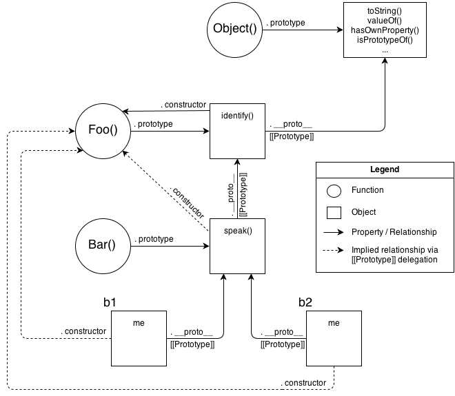

# prototype-chain

Recall from the last discussed topic, *this keyword*, what are the four things happen when we call a constructor (calling a function with `new` keyword)?

1. Create a brand new empty object (aka constructed) out of thin layer air.

2. Newly created/constructed object is linked to (`[[prototype]]`) the function's prototype. (All variables of the function (constructor in that case) we called are set as the attributes of that brand new object.)

3. Newly created/constructed object is set as the `this` binding for that function call.

4. Unless the function returns its own alternate object, the new-invoked call will automatically return the **newly created object**. (If the constructor doesn't return anything then the created object is returned.)

   



Let's write a code for this:

```js
function Foo(name) {
  console.log(this); // ob1
  this.me = name;    // ob1.me = name
}

Foo.prototype.identify = function() {
  return this.me;
}

function Bar(name) {
  Foo.call(this, name); // this ---> the brand new object created
}

Bar.prototype.__proto__ = Foo.prototype;
Bar.prototype.speak = function() {
  console.log('hello ${this.identify()}'); 
}

const ob1 = new Bar('Alice');
const ob2 = new Bar('Bob');

console.log(ob1.identify());
console.log(ob2.identify());


/*
things happened for new Bar():
     ____________________|
    /
   /
emptyObject ----------> object created for foo()   // caused by line 14
  \          
   \
    \
     \
      \
       \_________________________________
                                         \
                                          \
                                           \
'this' inside the function Bar points to emptyObject
                             _______________|
                            / 
                           /
inside Foo(), this -> emptyObject
              emptyObject.me is set to name

*/

```

If you look at the diagram carefully I hope you will get it. Yet, I'm clarifying it here for you. First when when call the constructor at the line 19, you know, a brand new *object* is created, this object has no property till now. Then the newly created object is linked to another object, for the *Foo()*, it's Object.prototype (here Object is global object, starts with Upper case O), and in case for *Bar()* we mutate it ans set it as Foo.prototype (which is actually the object created for the function *Foo()*), in *Foo()* you see we intialized the *me* property of the brand new object with *name*. And, at last the object (with the property *me* is returned and *ob1* is assigned to it).


Now consider these following codes and try to understand:

```js
function User(name) {
  this.name = name;
}

User.prototype.getName = function() {
  return this.name;
}

User.prototype.shout = function(){
  console.log('nooooooooooooooo');
}

const o1 = new User('a1');
const o2 = new User('a2');

o2.shout = function() {
  console.log('yaaaaaaaaaaaa');
}

o2.shout(); // yaaaaaaaaaaaa
o1.shout(); // nooooooooooooooo 
```

```js
function User(name) {
  this.name = name;
}

User.prototype.getName = function() {
  return this.name;
}

User.prototype.shout = function(){
  console.log('nooooooooooooooo');
}

const o1 = new User('a1');
const o2 = new User('a2');

// o2.shout = function() {
//   console.log('yaaaaaaaaaaaa');
// }

o2.shout(); // nooooooooooooooo
o1.shout(); // nooooooooooooooo
```

********* when a inherited function is executed, the value of `this` points to the *inherited function* not to the *prototype object* where the function is an own property. Look at the following example:

```js
var ob = {
  a: 2,
  f: function() {
      return this.a;
  }
}

const o1 = Object.create(ob);
o1.a = 9;
i
console.log(o1.f());  // 9
```

First let me talk about *`Object.create`*, it works as `new` keyword but instead of linking the brand new object with the object (.prototype) created for the constructor it takes a object as its parameter and link with it.

I mean in the above example, `o1.prototype === ob;`returns `true`, you can check it out yourself.

#### Various prototype chain when creating object/array/function

Ponder over this following code:

```js
const a = {a: 1};
console.log(a.__proto__ === Object.prototype); // true

const ar = [1, 3, 9];
console.log(ar.__proto__ === Array.prototype); // true

function f1() {
  // ../
}
console.log(f1.__proto__ === Function.prototype); // true
```

So we can get the chains as: 

​                                               *a ----------------> Object.prototype*

​                                               *ar ---------------> Array.prototype ----------------> Object.prototype*

​                                               *f1 ----------------> Function.prototype ----------------> Object.prototype*

​                      *here, ---------------------> denotes connected through dunder proto (`__proto__`)*

 #### OLOO (Object linked to other objects):

First let consider this example where we use bunch of functions to serve a purpose:

```js
function Shape(height, width) {
  this.height = height;
  this.width = width;
}

Shape.prototype.getHeight = function() {
  return this.height;
}

Shape.prototype.getWidth = function() {
  return this.width;
}

function Rectangle(height, width) {
  Shape.call(this, height, width);
}

Rectangle.prototype = Object.create(Shape.prototype);

Rectangle.prototype.getArea = function() {
  return this.height * this.width;
}

const r1 = new Rectangle(2, 3);
console.log('r1: ', r1);
console.log(r1.getArea());


// r1 -> Shape.prototype -> Object.prototype -> null 
```

Now we'll see how we can achieve the same just by using objects only- (***Object linked to other objects***).

```js
const Shape = {
  init: function(height, width) {
    this.height = height;
    this.width = width;
  },

  getHeight: function() {
    return this.height;
  },

  getWidth: function() {
    return this.width;
  },
}

const Rectangle = Object.create(Shape);
Rectangle.getArea =  function() {
  return this.height * this.width;
}

const r1 = Object.create(Rectangle);
r1.init(2, 3);
console.log('r1: ', r1);
console.log(r1.getArea());


// r1 -> Shape.prototype -> Object.prototype -> null 
```


